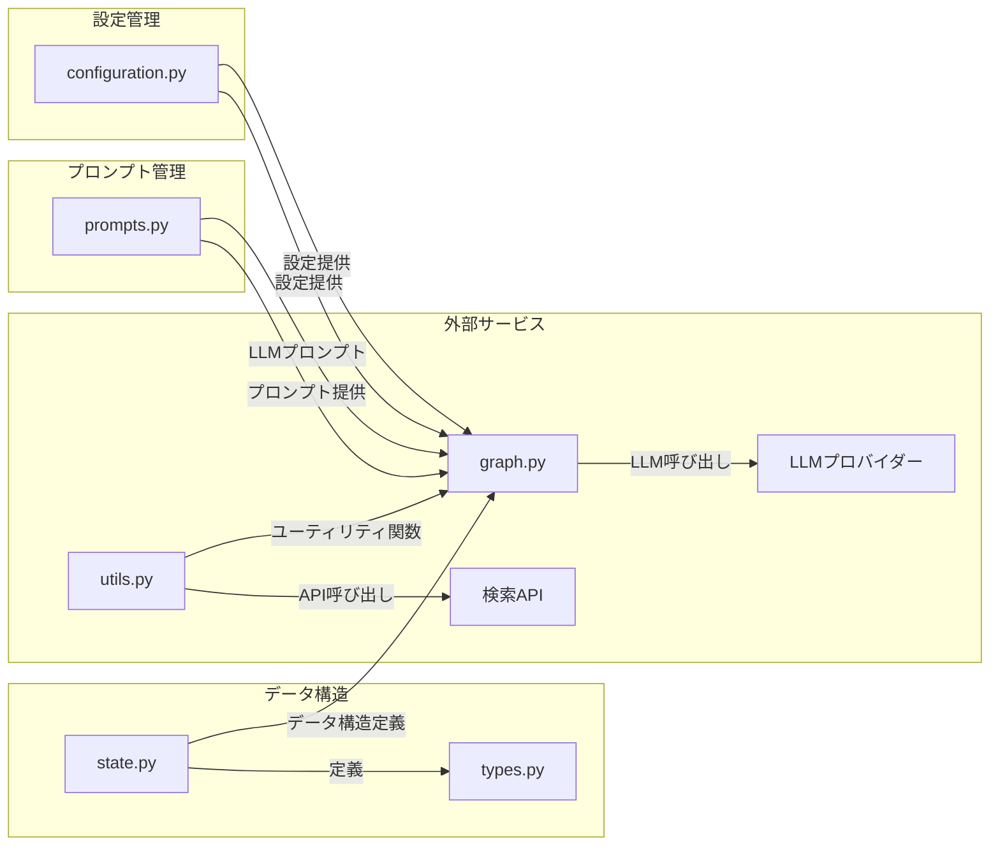

```mermaid
graph LR
    config[configuration.py] -->|設定提供| main_graph[graph.py]
    state[state.py] -->|データ構造定義| main_graph
    prompts[prompts.py] -->|LLMプロンプト| main_graph
    utils[utils.py] -->|ユーティリティ関数| main_graph

    subgraph "データ構造"
        state[state.py] -->|定義| types[types.py]
    end
    
    subgraph "外部サービス"
        utils -->|API呼び出し| search[検索API]
        main_graph -->|LLM呼び出し| llm[LLMプロバイダー]
    end
    
    subgraph "設定管理"
        config[configuration.py] -->|設定提供| main_graph
    end
    
    subgraph "プロンプト管理"
        prompts[prompts.py] -->|プロンプト提供| main_graph
    end

```