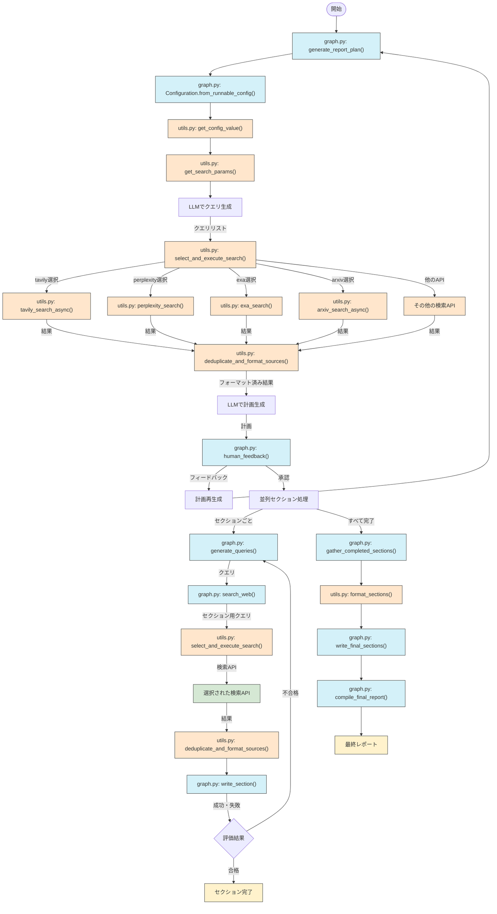

```mermaid
flowchart TD
    classDef graphFunction fill:#d4f1f9,stroke:#333
    classDef utilsFunction fill:#ffe6cc,stroke:#333
    classDef externalAPI fill:#d5e8d4,stroke:#333
    classDef dataStructure fill:#fff2cc,stroke:#333

    %% メインフロー - generate_report_plan
    Start([開始]) --> GeneratePlan["graph.py: generate_report_plan()"]:::graphFunction
    GeneratePlan --> GetConfig["graph.py: Configuration.from_runnable_config()"]:::graphFunction
    GetConfig --> GetConfigValue["utils.py: get_config_value()"]:::utilsFunction
    GetConfigValue --> GetSearchParams["utils.py: get_search_params()"]:::utilsFunction
    GetSearchParams --> GenerateSearchQueries["LLMでクエリ生成"]
    
    GenerateSearchQueries --> |クエリリスト| SelectSearch["utils.py: select_and_execute_search()"]:::utilsFunction
    
    %% 検索APIフロー
    SelectSearch --> |tavily選択| TavilySearch["utils.py: tavily_search_async()"]:::utilsFunction
    SelectSearch --> |perplexity選択| PerplexitySearch["utils.py: perplexity_search()"]:::utilsFunction
    SelectSearch --> |exa選択| ExaSearch["utils.py: exa_search()"]:::utilsFunction
    SelectSearch --> |arxiv選択| ArxivSearch["utils.py: arxiv_search_async()"]:::utilsFunction
    SelectSearch --> |他のAPI| OtherSearch["その他の検索API"]:::utilsFunction
    
    TavilySearch & PerplexitySearch & ExaSearch & ArxivSearch & OtherSearch --> |結果| FormatSources["utils.py: deduplicate_and_format_sources()"]:::utilsFunction
    
    FormatSources --> |フォーマット済み結果| GenerateSections["LLMで計画生成"]
    GenerateSections --> |計画| HumanFeedback["graph.py: human_feedback()"]:::graphFunction
    
    %% 人間フィードバックと分岐
    HumanFeedback --> |フィードバック| Regenerate["計画再生成"]
    Regenerate --> GeneratePlan
    
    HumanFeedback --> |承認| ParallelProcess["並列セクション処理"]
    
    %% セクション処理
    ParallelProcess --> |セクションごと| GenerateQueries["graph.py: generate_queries()"]:::graphFunction
    GenerateQueries --> |クエリ| SearchWeb["graph.py: search_web()"]:::graphFunction
    
    SearchWeb --> |セクション用クエリ| SectionSearch["utils.py: select_and_execute_search()"]:::utilsFunction
    SectionSearch --> |検索API| APICall["選択された検索API"]:::externalAPI
    APICall --> |結果| FormatSectionResults["utils.py: deduplicate_and_format_sources()"]:::utilsFunction
    
    FormatSectionResults --> WriteSection["graph.py: write_section()"]:::graphFunction
    WriteSection --> |成功・失敗| Evaluate{評価結果}
    
    Evaluate --> |不合格| GenerateQueries
    Evaluate --> |合格| CompletedSection["セクション完了"]:::dataStructure
    
    %% 最終ステージ
    ParallelProcess --> |すべて完了| GatherSections["graph.py: gather_completed_sections()"]:::graphFunction
    GatherSections --> FormatAllSections["utils.py: format_sections()"]:::utilsFunction
    
    FormatAllSections --> WriteFinal["graph.py: write_final_sections()"]:::graphFunction
    WriteFinal --> CompileReport["graph.py: compile_final_report()"]:::graphFunction
    CompileReport --> FinalReport["最終レポート"]:::dataStructure
```