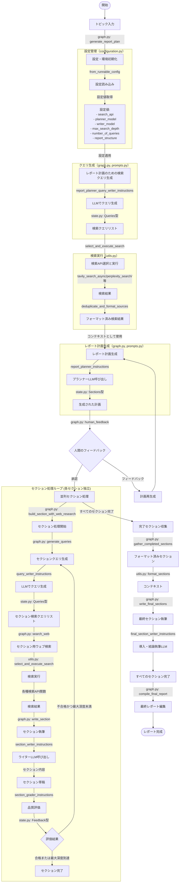

```mermaid
flowchart TD
    Start([開始]) --> Input[トピック入力]
    Input --> |graph.py: generate_report_plan| Setup[設定・環境初期化]
    
    subgraph "設定管理（configuration.py）"
        Setup --> |from_runnable_config| LoadConfig[設定読み込み]
        LoadConfig --> |設定値取得| ConfigValues[設定値:
        - search_api
        - planner_model
        - writer_model
        - max_search_depth
        - number_of_queries
        - report_structure]
    end
    
    ConfigValues --> |設定適用| PlanSearch[レポート計画のための検索クエリ生成]
    
    subgraph "クエリ生成（graph.py, prompts.py）"
        PlanSearch --> |report_planner_query_writer_instructions| GenerateQueryLLM[LLMでクエリ生成]
        GenerateQueryLLM --> |state.py: Queries型| QueryList[検索クエリリスト]
    end
    
    subgraph "検索実行（utils.py）"
        QueryList --> |select_and_execute_search| SearchAPI[検索API選択と実行]
        SearchAPI --> |tavily_search_async/perplexity_search/等| SearchResults[検索結果]
        SearchResults --> |deduplicate_and_format_sources| FormattedResults[フォーマット済み検索結果]
    end
    
    FormattedResults --> |コンテキストとして使用| PlanGeneration[レポート計画生成]
    
    subgraph "レポート計画生成（graph.py, prompts.py）"
        PlanGeneration --> |report_planner_instructions| PlannerLLM[プランナーLLM呼び出し]
        PlannerLLM --> |state.py: Sections型| GeneratedPlan[生成された計画]
    end
    
    GeneratedPlan --> |graph.py: human_feedback| HumanFeedback{人間のフィードバック}
    HumanFeedback -->|フィードバック| RegeneratePlan[計画再生成]
    RegeneratePlan --> PlanGeneration
    
    HumanFeedback -->|承認| ParallelProcess[並列セクション処理]
    
    subgraph "セクション処理ループ (各セクション独立)"
        ParallelProcess --> |graph.py: build_section_with_web_research| SectionProcess[セクション処理開始]
        
        SectionProcess --> |graph.py: generate_queries| SectionQueries[セクションクエリ生成]
        SectionQueries --> |query_writer_instructions| QueryGenLLM[LLMでクエリ生成]
        QueryGenLLM --> |state.py: Queries型| SectionQueryList[セクション検索クエリリスト]
        
        SectionQueryList --> |graph.py: search_web| SectionSearch[セクション用ウェブ検索]
        SectionSearch --> |utils.py: select_and_execute_search| ExecuteSearch[検索実行]
        ExecuteSearch --> |各種検索API関数| SectionSearchResults[検索結果]
        
        SectionSearchResults --> |graph.py: write_section| WritingSection[セクション執筆]
        WritingSection --> |section_writer_instructions| WriterLLM[ライターLLM呼び出し]
        WriterLLM --> |セクション内容| SectionDraft[セクション草稿]
        
        SectionDraft --> |section_grader_instructions| Evaluation[品質評価]
        Evaluation --> |state.py: Feedback型| EvalResult{評価結果}
        
        EvalResult -->|不合格かつ最大深度未満| SectionQueries
        EvalResult -->|合格または最大深度到達| CompletedSection[セクション完了]
    end
    
    ParallelProcess --> |すべてのセクション完了| GatherSections[完了セクション収集]
    
    GatherSections --> |graph.py: gather_completed_sections| FormattedSections[フォーマット済みセクション]
    FormattedSections --> |utils.py: format_sections| Context[コンテキスト]
    
    Context --> |graph.py: write_final_sections| FinalSections[最終セクション執筆]
    FinalSections --> |final_section_writer_instructions| FinalSectionsLLM[導入・結論執筆LLM]
    FinalSectionsLLM --> AllSectionsComplete[すべてのセクション完了]
    
    AllSectionsComplete --> |graph.py: compile_final_report| FinalReport[最終レポート編集]
    FinalReport --> EndReport([レポート完成])
```