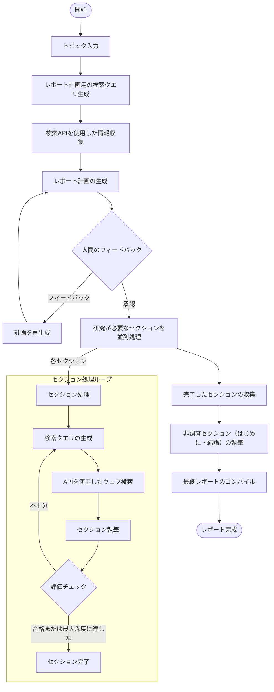

```mermaid
graph TD
    Start([開始]) --> Input[トピック入力]
    Input --> PlanSearch[レポート計画用の検索クエリ生成]
    PlanSearch --> WebSearchPlan[検索APIを使用した情報収集]
    WebSearchPlan --> GeneratePlan[レポート計画の生成]
    GeneratePlan --> HumanFeedback{人間のフィードバック}
    
    HumanFeedback -->|フィードバック| RegeneratePlan[計画を再生成]
    RegeneratePlan --> GeneratePlan
    
    HumanFeedback -->|承認| ParallelProcess[研究が必要なセクションを並列処理]
    
    ParallelProcess --> |各セクション| SectionProcess[セクション処理]
    
    subgraph "セクション処理ループ"
        SectionProcess --> GenerateQueries[検索クエリの生成]
        GenerateQueries --> WebSearch[APIを使用したウェブ検索]
        WebSearch --> WriteSection[セクション執筆]
        WriteSection --> Evaluate{評価チェック}
        Evaluate -->|不十分| GenerateQueries
        Evaluate -->|合格または最大深度に達した| CompletedSection[セクション完了]
    end
    
    ParallelProcess --> GatherSections[完了したセクションの収集]
    GatherSections --> WriteFinalSections[非調査セクション（はじめに・結論）の執筆]
    WriteFinalSections --> CompileFinalReport[最終レポートのコンパイル]
    CompileFinalReport --> EndReport([レポート完成])
```